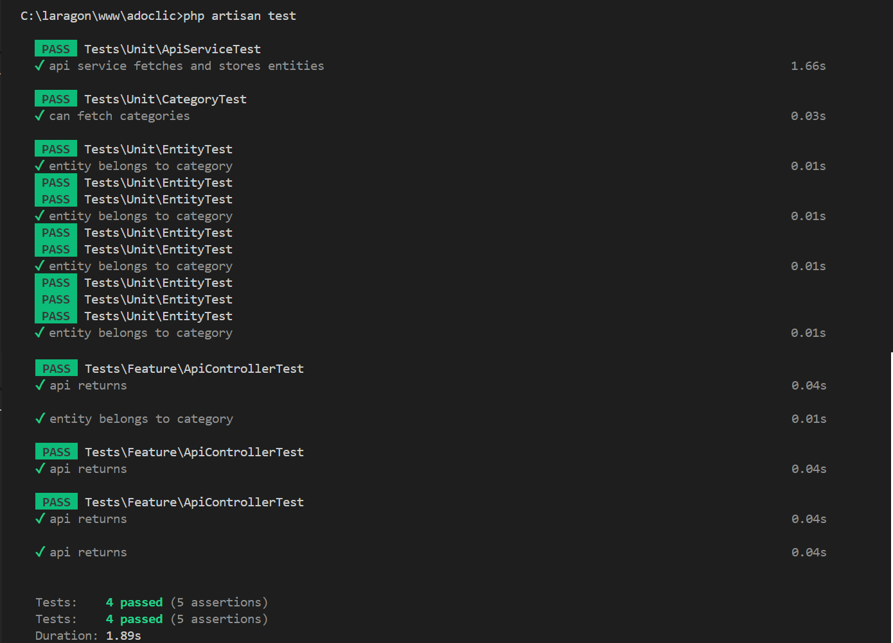

# TEST ADOCLIC - API EN LARAVEL

## Puesta en Marcha

### Datos y base de datos: 

***Opcion 1:***

Se puede ejecutar las migraciones y seeders:

*php artisan migrate*

*php artisan db:seed*

***Opcion 2:***

Se puede importar el archivo adoclic.sql en la base de datos.

## USO DE API Y CONTROLADORES
### Obtener de categorías

``http
  GET /api/{Category}  
``

**Ejemplos:**

http://localhost:8000/api/Animals
http://localhost:8000/api/Security

| Parametro | Tipo     | Descripción                |
| :-------- | :------- | :------------------------- |
| `Category` | `string` | **Requerido.** Categoría a buscar |

### Buscar data de la api or del archivo JSON entity.

``http
  http://localhost:8000/fetch-data
``

### Verificar categorias en la base de datos:
http://localhost:8000/categories

## PRUEBAS UNITARIAS

